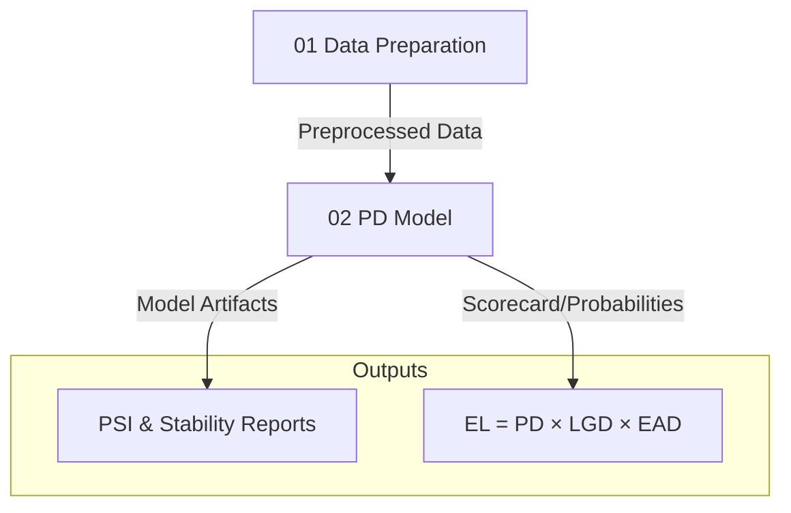

# Credit Risk Modeling Pipeline


A comprehensive, end-to-end credit risk modeling enterprise solution. This project implements the full banking credit risk lifecycle — from raw data ingestion and feature engineering to probability of default (PD) modeling, loss estimation, and automated population stability monitoring.

Implemented as part of the 365 Careers Data Science Case Study.

[📜 View Completion Certificate](https://drive.google.com/file/d/1FjMDLmfbjUBfmEpRC9NLy3EvwZgU0kw5/view?usp=sharing)

## Features

- **End-to-End Pipeline** — Seamless transition from raw LendingClub data to Expected Loss (EL) calculations.
- **Advanced Feature Engineering** — Sophisticated Weight of Evidence (WoE) and Information Value (IV) calculations for fine-classing and coarse-classing.
- **PD/LGD/EAD Modeling** — Implementation of Probability of Default (Logistic), Loss Given Default (Two-stage), and Exposure at Default (Linear) models.
- **Model Monitoring & Stability** — Automated Population Stability Index (PSI) analysis to detect distribution shifts in real-time.
- **Regulatory-Ready Scoring** — Scorecard creation with point-to-odds scaling and credit scoring logic.

## Architecture

The project is structured into four sequential modules that form a robust risk estimation engine:



## Tech Stack

| Layer | Technology |
|---|---|
| **Programming** | Python 3.8+ |
| **Analysis** | Pandas, NumPy, Scipy |
| **Modeling** | Scikit-Learn, Statsmodels |
| **Visualization** | Matplotlib, Seaborn |
| **Serialization** | Pickle / Joblib (.sav) |

## Project Structure

```
credit-risk-modeling/
├── 01_Data_Preparation.ipynb          # Data cleaning, WoE/IV engineering
├── 02_PD_Model.ipynb                  # Probability of Default development
├── 03_Monitoring.ipynb                # PSI and feature stability analysis
├── 04_Calculating_Expected_Loss.ipynb # LGD, EAD, and EL integration
├── data/                              # Data file directory (see data/README.md)
│   ├── raw/                           # Input CSVs (gitignored)
│   └── processed/                     # Intermediate artifacts
├── requirements.txt                   # Dependency list
└── README.md                          # Main documentation
```

## Getting Started

### 1. Prerequisites
- Python 3.8+
- Jupyter Notebook or Lab

### 2. Installation
```bash
git clone https://github.com/aktilekishanov/credit-risk-modeling.git
cd credit-risk-modeling
pip install -r requirements.txt
```

### 3. Data Setup
Large datasets are gitignored. Download them from the following sources and place them in `data/raw/`:
- [LendingClub 2007-2014](https://www.dropbox.com/scl/fi/rzqaawjqwt4qe3rmnnxiw/loan_data_2007_2014.csv?rlkey=a5y6ojznit1ozu8fwt0m7w11w&e=1&dl=0)
- [LendingClub 2015](https://www.dropbox.com/scl/fi/kywjooafv2jclu6epwe1o/loan_data_2015.csv?rlkey=0d6d9p05dhw2ln8ejacd4mqsp&e=1&dl=0)

## Execution Order

To reproduce the results, execute the notebooks in this specific order:

1.  **`01_Data_Preparation.ipynb`**: Cleans the raw CSVs and applies feature transformations.
2.  **`02_PD_Model.ipynb`**: Trains the logistic regression model and validates with AUROC (~0.75).
3.  **`03_Monitoring.ipynb`**: Compares 2007-2014 data against 2015 data using PSI.
4.  **`04_Calculating_Expected_Loss.ipynb`**: Integrates LGD and EAD components to calculate final dollar-value Expected Loss.

## Model Performance Summary

| Model | Primary Metric | Result |
|---|---|---|
| **PD Model** | AUROC | ~0.75 |
| **PD Model** | Accuracy | ~85% |
| **LGD Stage 1** | AUROC | ~0.70 |
| **EAD Model** | R² | ~0.30 |

## Author

**Aktilek Ishanov**

---
*Note: This project is for educational purposes as part of a comprehensive case study.*
